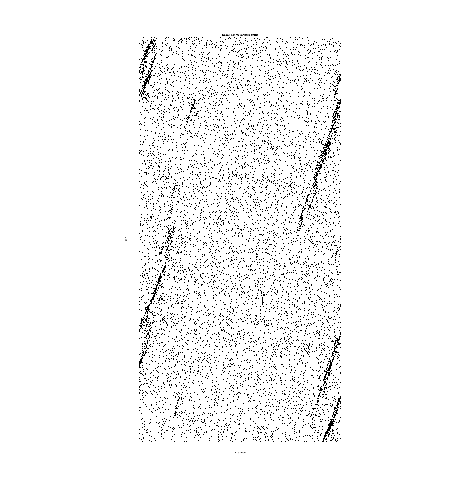

# Nagel-Schreckenberg model

The Nagel-Schreckenberg model was proposed in Nagel and Schreckenberg (1992). It is a cellular automaton model for traffic flow on a road with a single lane. The model is based on the following four rules:

1. Acceleration: If the velocity of a car is lower than the maximum velocity $v_{max}$, it is increased by one unit: $v_i \rightarrow v_i + 1$.
2. Slowing down: If the distance to the next car ahead is lower than the current velocity, the velocity is reduced to this distance: $v_i \rightarrow d_i - 1$.
3. Randomization: With probability $p$, the velocity of each car is reduced by one unit: $v_i \rightarrow v_i - 1$.
4. Car motion: Each car is moved forward by $v_i$ units.

The model is implemented in the file `nagelSchreckenbergTraffic.m`. The function `nagelSchreckenbergTraffic` takes the following input arguments:

* cars -> number of cars
* v_max -> maximum velocity
* p -> probability of randomization
* slots -> number of slots
* steps -> number of steps
* burn  -> number of steps to burn

## Example

    nagelSchreckenbergTraffic(100, 5, 2/5, 1000, 2000, 1000)

### Output

